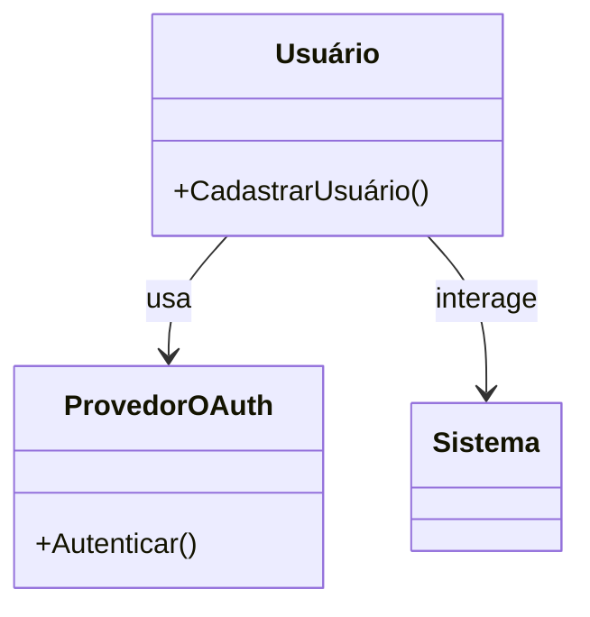

🔙 [Retornar à documentação principal](../../README.md)

# Caso de Uso UML: Cadastrar Usuário

## Diagrama de Caso de Uso

## Descrição

Permite que um usuário se cadastre no sistema usando e-mail/senha ou OAuth, com verificação de e-mail para cadastros tradicionais.

## Atores

- **Primário**: Usuário
- **Secundário**: Provedor OAuth (Facebook, Google, LinkedIn)

## Pré-condições

- Usuário não possui conta no sistema.
- Provedores OAuth estão configurados.

## Pós-condições

- Usuário é cadastrado com status "verificado" (OAuth) ou "não verificado" (tradicional).
- E-mail de verificação é enviado (tradicional).
- E-mail de boas-vindas é enviado (OAuth).

## Fluxo Principal

1. Usuário acessa a tela de cadastro.
2. Usuário escolhe método:
   - **Tradicional**:
     - Preenche formulário (e-mail, senha, nome).
     - Sistema valida (e-mail único, senha forte).
     - Cria usuário com status "não verificado".
     - Envia e-mail de verificação.
     - Usuário clica no link e é marcado como verificado.
   - **OAuth**:
     - Redireciona para provedor OAuth.
     - Provedor autentica e retorna dados (e-mail, nome).
     - Sistema cria/atualiza usuário.
     - Envia e-mail de boas-vindas.
3. Redireciona para login (tradicional) ou dashboard (OAuth).

## Fluxos Alternativos

- **A1**: E-mail já registrado → Exibe erro e solicita outro e-mail.
- **A2**: Link de verificação inválido → Exibe erro e oferece reenvio.
- **A3**: Falha na autenticação OAuth → Exibe erro e retorna à tela de cadastro.

## Regras de Negócio

- E-mails são únicos.
- Senhas exigem 8 caracteres, com letras e números.
- Links de verificação expiram em 24 horas.
- Usuários OAuth não precisam de verificação adicional.

## Integrações

- Usa **Laravel Socialite** para OAuth.
- Integra com sistema de e-mails (Laravel Mail).
- Dados do usuário alimentam o perfil.
