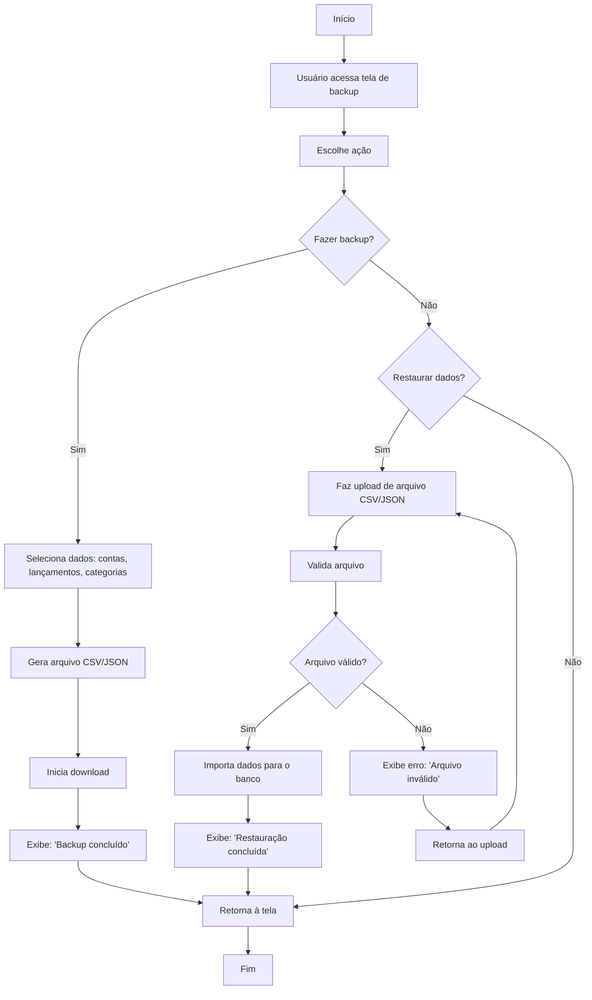

🔙 [Retornar à documentação principal](../../README.md)

# Fluxograma: Backup/Restauração de Dados

Este documento descreve o processo de backup e restauração de dados do usuário (contas, lançamentos, categorias).

## Diagrama de Fluxo

## Descrição do Processo

### Backup

1. Usuário seleciona dados para backup (contas, lançamentos, categorias).
2. Sistema gera arquivo CSV/JSON.
3. Inicia download e exibe confirmação.
4. Retorna à tela.

### Restauração

1. Usuário faz upload de arquivo CSV/JSON.
2. Sistema valida (formato, integridade).
3. Se válido, importa dados e exibe confirmação.
4. Se inválido, exibe erro e retorna ao upload.

## Regras de Negócio

- Backup inclui apenas dados do usuário logado.
- Arquivos CSV/JSON seguem esquema predefinido.
- Restauração sobrescreve dados existentes (após confirmação).
- Arquivos inválidos ou corrompidos são rejeitados.
- Backup é criptografado para segurança.

## Integrações

- Backup inclui contas, lançamentos, categorias e configurações.
- Integra com sistema de autenticação para verificar usuário.
- Arquivos são armazenáveis em nuvem (ex.: Google Drive) via exportação.
- Restauração atualiza saldos e relatórios.
