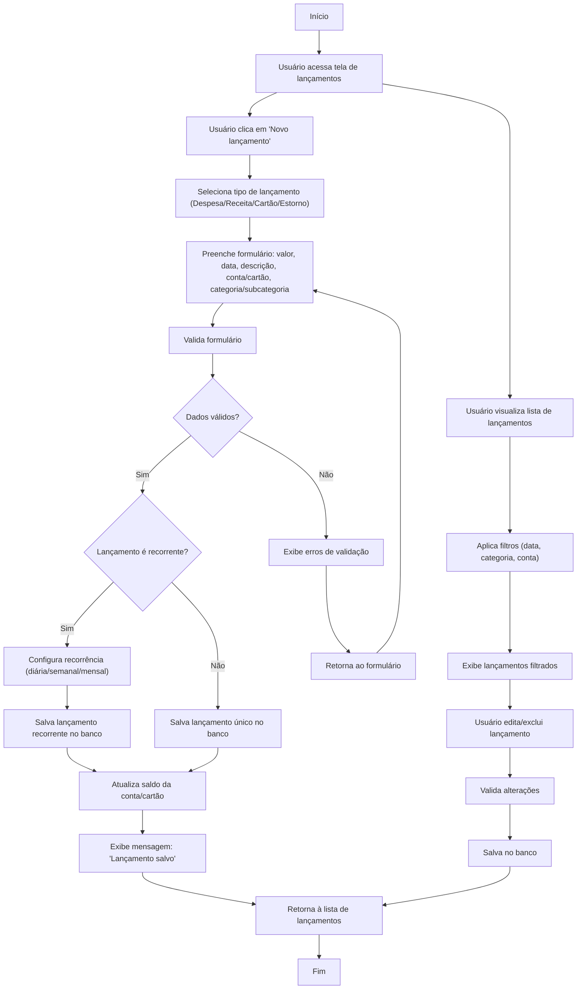

# [ <- VOLTAR](../../README.md)

# Fluxograma de Gerenciamento de Lançamentos Financeiros

Este documento descreve o processo completo de criação, visualização e edição de lançamentos financeiros no sistema, incluindo o tratamento de lançamentos recorrentes.

## Diagrama de Fluxo

## Descrição do Processo

### Criação de Lançamentos

1. Usuário acessa a tela de lançamentos e clica em "Novo lançamento"
2. Seleciona o tipo de lançamento:
   - Despesa
   - Receita
   - Cartão
   - Estorno
3. Preenche o formulário com as informações necessárias:
   - Valor
   - Data
   - Descrição
   - Conta/cartão
   - Categoria/subcategoria
4. Sistema valida o formulário:
   - Se dados válidos: continua o processo
   - Se dados inválidos: exibe erros e retorna ao formulário

### Lançamentos Recorrentes

1. Usuário indica se o lançamento é recorrente
2. Para lançamentos recorrentes:
   - Configura frequência (diária/semanal/mensal)
   - Define data de início e (opcionalmente) data de término
3. Sistema salva a configuração de recorrência

### Finalização do Lançamento

1. Sistema salva o lançamento no banco de dados
2. Atualiza o saldo da conta/cartão relacionado
3. Exibe mensagem de confirmação
4. Retorna à lista de lançamentos

### Visualização e Edição

1. Usuário visualiza lista de lançamentos
2. Aplica filtros por data, categoria ou conta
3. Edita ou exclui lançamentos existentes
4. Sistema valida as alterações e salva no banco
5. Retorna à lista atualizada

## Regras de Negócio

- Lançamentos de despesa diminuem o saldo da conta
- Lançamentos de receita aumentam o saldo da conta
- Lançamentos de cartão geram fatura para pagamento futuro
- Estornos revertem operações anteriores
- Lançamentos recorrentes geram registros individuais a cada ocorrência
- Edições em lançamentos recorrentes podem afetar ocorrências futuras

## Notas Técnicas

- A atualização de saldos é processada via triggers de banco de dados
- Notificações são enviadas quando o saldo atinge valores críticos
- Relatórios mensais são gerados automaticamente
