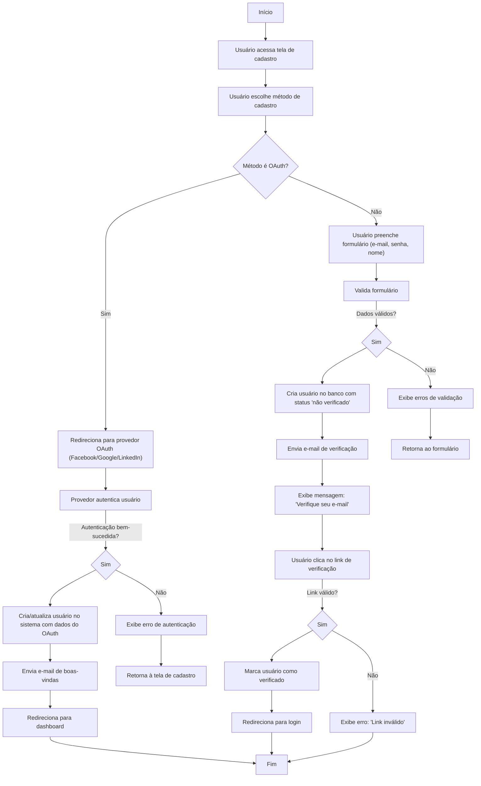

🔙 [Retornar à documentação principal](../../README.md)

# Fluxograma de Cadastro de Usuário

Este documento descreve o processo completo de cadastro de usuário no sistema, incluindo fluxos de autenticação OAuth e cadastro tradicional.

## Diagrama de Fluxo

## Descrição do Processo

### Fluxo OAuth

1. Usuário escolhe entrar com provedor OAuth (Facebook/Google/LinkedIn)
2. Sistema redireciona para a página de autenticação do provedor
3. Após autenticação bem-sucedida, o sistema:
   - Cria uma nova conta se o usuário não existir
   - Atualiza informações se o usuário já existir
4. Envia e-mail de boas-vindas
5. Redireciona para o dashboard

### Fluxo Tradicional

1. Usuário preenche formulário com e-mail, senha e nome
2. Sistema valida os dados:
   - Se inválidos: exibe erros e retorna ao formulário
   - Se válidos: cria usuário com status "não verificado"
3. Sistema envia e-mail de verificação
4. Usuário clica no link de verificação:
   - Se válido: marca usuário como verificado e redireciona para login
   - Se inválido: exibe mensagem de erro

## Notas Adicionais

- Todos os e-mails são enviados de forma assíncrona usando filas
- Links de verificação expiram após 24 horas
- OAuth não requer verificação adicional de e-mail
