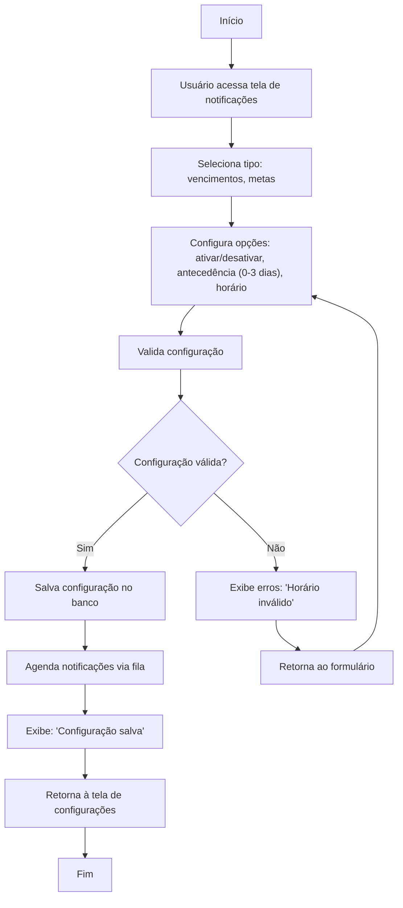

🔙 [Retornar à documentação principal](../../README.md)

# Fluxograma: Configuração de Notificações

Este documento descreve o processo de configuração de notificações para vencimentos e metas.

## Diagrama de Fluxo

## Descrição do Processo

### Configuração de Notificações

1. Usuário acessa tela de notificações e seleciona tipo (vencimentos, metas).
2. Configura:
   - Ativar/desativar.
   - Antecedência (0-3 dias).
   - Horário de envio.
3. Sistema valida:
   - Horário dentro de faixa válida (ex.: 00:00-23:59).
4. Se válido, salva configuração, agenda notificações (via fila) e exibe confirmação.
5. Se inválido, exibe erros e retorna ao formulário.

## Regras de Negócio

- Notificações de vencimentos são baseadas em datas de lançamentos/cartões.
- Antecedência máxima é 3 dias.
- Notificações podem ser desativadas por tipo.
- Horários são ajustados ao fuso horário do usuário.
- Notificações push exigem permissão do dispositivo.

## Integrações

- Usa filas do Laravel (ex.: Horizon) para envio assíncrono.
- Integra com lançamentos e faturas para vencimentos.
- Suporta notificações push (via PWA) e e-mail.
- Configurações são salvas no perfil do usuário.
