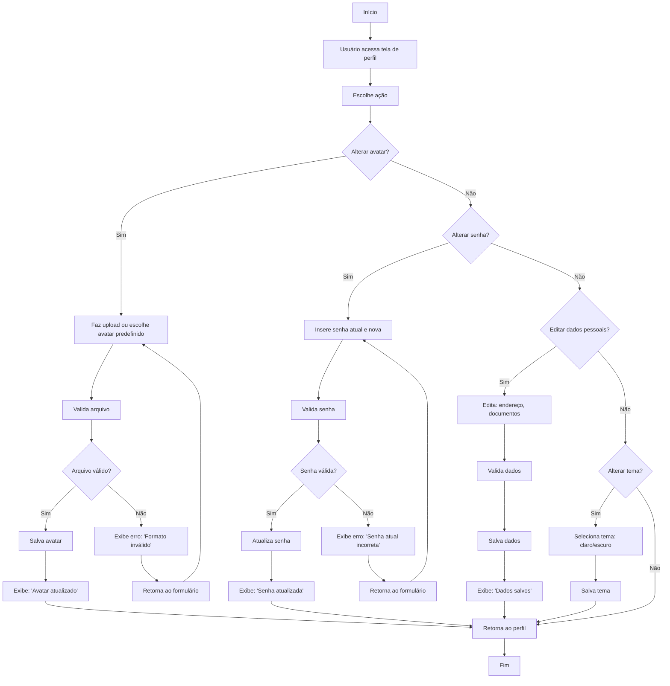

🔙 [Retornar à documentação principal](../../README.md)

# Fluxograma: Configuração de Perfil

Este documento descreve o processo de configuração do perfil do usuário, incluindo avatar, senha, dados pessoais e temas.

## Diagrama de Fluxo

## Descrição do Processo

### Alteração de Avatar

1. Usuário faz upload ou escolhe avatar predefinido.
2. Sistema valida (formato, tamanho).
3. Se válido, salva e exibe confirmação.
4. Se inválido, exibe erro e retorna ao formulário.

## Alteração de Senha

1. Usuário insere senha atual e nova.
2. Sistema valida (senha atual correta, nova atende política).
3. Se válido, atualiza senha e exibe confirmação.
4. Se inválido, exibe erro e retorna ao formulário.

## Edição de Dados Pessoais

1. Usuário edita endereço e documentos.
2. Sistema valida e salva.
3. Exibe confirmação e retorna ao perfil.

## Alteração de Tema

1. Usuário seleciona tema (claro/escuro).
2. Sistema salva e aplica tema.

## Regras de Negócio

- Avatares suportam formatos PNG/JPG, máximo 2 MB.
- Senhas devem ter 8 caracteres, com letras e números.
- Documentos são criptografados no banco.
- Temas são aplicados imediatamente e salvos no perfil.

## Integrações

- Avatar aparece no dashboard e relatórios.
- Dados pessoais são usados em exportações (ex.: PDF).
- Tema afeta toda a interface (PWA e web).
- Integra com sistema de notificações para confirmações.
