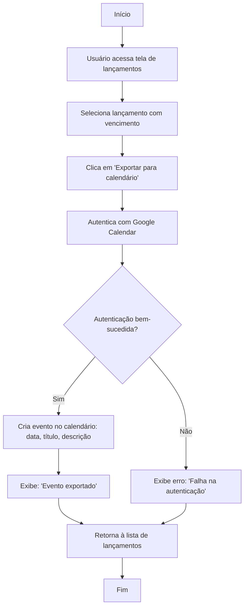

🔙 [Retornar à documentação principal](../../README.md)

# Fluxograma: Exportação para Calendário

Este documento descreve o processo de exportação de vencimentos de lançamentos para o Google Calendar.

## Diagrama de Fluxo

## Descrição do Processo

### Exportação

1. Usuário seleciona um lançamento com data de vencimento.
2. Clica em "Exportar para calendário".
3. Sistema autentica com Google Calendar via OAuth.
4. Se autenticação bem-sucedida:
   - Cria evento com data, título (ex.: "Pagar fatura") e descrição.
   - Exibe confirmação.
5. Se falhar, exibe erro.
6. Retorna à lista de lançamentos.

## Regras de Negócio

- Apenas lançamentos com vencimento podem ser exportados.
- Eventos são criados no calendário padrão do usuário.
- Título do evento inclui tipo de lançamento (ex.: "Despesa: Aluguel").
- Autenticação OAuth é armazenada para reutilização.

## Integrações

- Usa API do Google Calendar.
- Integra com lançamentos e faturas.
- Eventos exportados aparecem em relatórios de vencimentos.
- Requer permissão de escrita no calendário.
