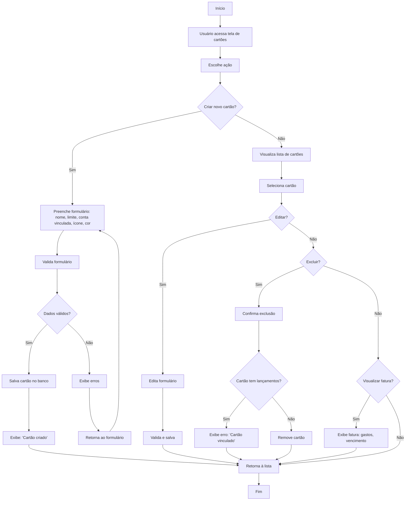

🔙 [Retornar à documentação principal](../../README.md)

# Fluxograma de Gerenciamento de Cartões de Crédito

Este documento descreve o processo completo de criação, visualização, edição, exclusão e gerenciamento de faturas de cartões de crédito no sistema financeiro.

## Diagrama de Fluxo

## Descrição do Processo

### Criação de Cartões de Crédito

1. Usuário acessa a tela de cartões e escolhe criar um novo cartão
2. Preenche o formulário com:
   - Nome do cartão
   - Limite de crédito
   - Conta bancária vinculada
   - Ícone personalizado
   - Cor personalizada
3. Sistema valida o formulário:
   - Se dados válidos: salva o cartão e exibe confirmação
   - Se dados inválidos: exibe erros e retorna ao formulário

### Visualização e Edição

1. Usuário visualiza lista completa de cartões
2. Seleciona um cartão específico
3. Pode editar os dados:
   - Atualiza informações necessárias
   - Sistema valida e salva alterações
   - Retorna à lista de cartões

### Exclusão de Cartões

1. Usuário seleciona um cartão e escolhe excluir
2. Sistema verifica se o cartão possui lançamentos vinculados:
   - Se possui: exibe mensagem de erro informando que o cartão está vinculado
   - Se não possui: remove o cartão do sistema
3. Retorna à lista de cartões

### Visualização de Faturas

1. Usuário seleciona um cartão e escolhe visualizar fatura
2. Sistema exibe detalhes da fatura atual:
   - Lista de gastos/lançamentos
   - Data de vencimento
   - Valor total
   - Valor mínimo (opcional)
3. Retorna à lista de cartões

## Regras de Negócio

- Cada cartão deve estar vinculado a uma conta bancária válida
- Nomes de cartões devem ser únicos para o mesmo usuário
- Cartões com lançamentos não podem ser excluídos
- O limite de crédito deve ser um valor positivo
- Faturas são geradas automaticamente com base no ciclo de fechamento do cartão
- O sistema deve alertar quando o uso do cartão estiver próximo ao limite

## Integrações

- Os cartões aparecem como opção de pagamento na tela de lançamentos
- As faturas são incluídas na lista de vencimentos para notificações
- Pagamentos de faturas são registrados como transferências da conta para o cartão
- Relatórios financeiros incluem análises de gastos com cartões de crédito
- O sistema pode exportar faturas em formato PDF para arquivamento ou impressão
