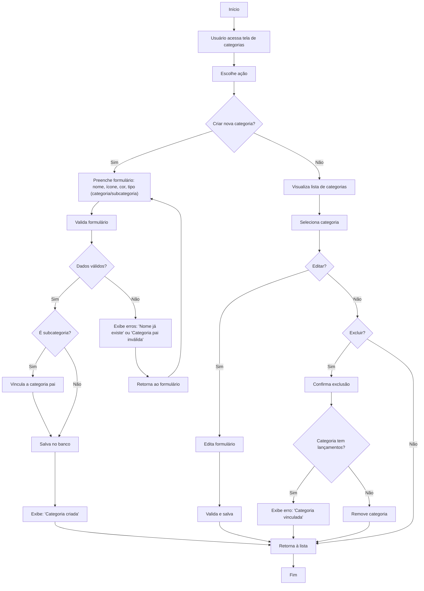

# [ <- VOLTAR](../../README.md)

# Fluxograma: Gerenciamento de Categorias/Subcategorias

Este documento descreve o processo de criação, visualização, edição e exclusão de categorias e subcategorias.

## Diagrama de Fluxo

## Descrição do Processo

### Criação de Categorias

1. Usuário acessa tela de categorias e preenche formulário com:
   - Nome, ícone, cor, tipo (categoria/subcategoria).
2. Sistema valida:Sistema redireciona para a página de autenticação do provedor
   - Nome único, categoria pai válida (se subcategoria).
3. Se válido, salva (vinculando a pai, se aplicável) e exibe confirmação.
4. Se inválido, exibe erros e retorna ao formulário.

### Visualização e Edição

1. Usuário visualiza lista de categorias/subcategorias.
2. Seleciona item para editar:
   - Atualiza formulário, valida e salva.
   - Retorna à lista.

## Regras de Negócio

- Nomes de categorias/subcategorias são únicos por usuário.
- Categorias com lançamentos não podem ser excluídas.
- Subcategorias exigem uma categoria pai válida.
- Sistema oferece categorias predefinidas (ex.: Alimentação, Transporte).
- Suporta hierarquia de múltiplos níveis.

## Integrações

- Categorias aparecem em lançamentos.
- Integra com relatórios para análise de gastos.
- Categorias predefinidas são importadas na inicialização do usuário.
