🔙 [Retornar à documentação principal](../../README.md)

# Fluxograma: Gerenciamento de Categorias/Subcategorias

Este documento descreve o processo de criação, visualização, edição e exclusão de categorias e subcategorias.

## Diagrama de Fluxo

```mermaid
flowchart TD
    A["Início"] --> B["Usuário acessa tela de categorias"]
    B --> C["Escolhe ação"]
    C --> D{"Criar nova categoria?"}
    D -->|Sim| E["Preenche formulário: nome, ícone, cor, tipo (categoria/subcategoria)"]
    E --> F["Valida formulário"]
    F --> G{"Dados válidos?"}
    G -->|Sim| H{"É subcategoria?"}
    H -->|Sim| I["Vincula a categoria pai"]
    I --> J["Salva no banco"]
    H -->|Não| J
    J --> K["Exibe: 'Categoria criada'"]
    K --> L["Retorna à lista"]
    L --> M["Fim"]
    G -->|Não| N["Exibe erros: 'Nome já existe' ou 'Categoria pai inválida'"]
    N --> O["Retorna ao formulário"]
    O --> E
    D -->|Não| P["Visualiza lista de categorias"]
    P --> Q["Seleciona categoria"]
    Q --> R{"Editar?"}
    R -->|Sim| S["Edita formulário"]
    S --> T["Valida e salva"]
    T --> L
    R -->|Não| U{"Excluir?"}
    U -->|Sim| V["Confirma exclusão"]
    V --> W{"Categoria tem lançamentos?"}
    W -->|Sim| X["Exibe erro: 'Categoria vinculada'"]
    X --> L
    W -->|Não| Y["Remove categoria"]
    Y --> L
    U -->|Não| L
```

## Descrição do Processo

### Criação de Categorias

1. Usuário acessa tela de categorias e preenche formulário com:
   - Nome, ícone, cor, tipo (categoria/subcategoria).
2. Sistema valida:Sistema redireciona para a página de autenticação do provedor
   - Nome único, categoria pai válida (se subcategoria).
3. Se válido, salva (vinculando a pai, se aplicável) e exibe confirmação.
4. Se inválido, exibe erros e retorna ao formulário.

### Visualização e Edição

1. Usuário visualiza lista de categorias/subcategorias.
2. Seleciona item para editar:
   - Atualiza formulário, valida e salva.
   - Retorna à lista.

## Regras de Negócio

- Nomes de categorias/subcategorias são únicos por usuário.
- Categorias com lançamentos não podem ser excluídas.
- Subcategorias exigem uma categoria pai válida.
- Sistema oferece categorias predefinidas (ex.: Alimentação, Transporte).
- Suporta hierarquia de múltiplos níveis.

## Integrações

- Categorias aparecem em lançamentos.
- Integra com relatórios para análise de gastos.
- Categorias predefinidas são importadas na inicialização do usuário.
