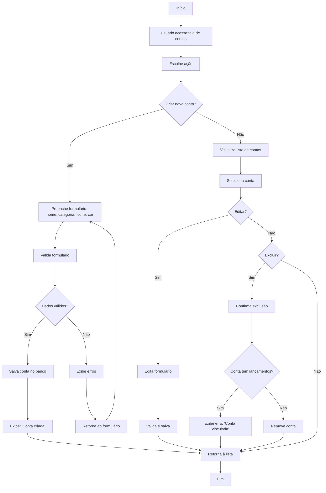

# Fluxograma de Gerenciamento de Contas

Este documento descreve o processo completo de criação, visualização, edição e exclusão de contas no sistema financeiro.

## Diagrama de Fluxo

## Descrição do Processo

### Criação de Contas

1. Usuário acessa a tela de contas e escolhe criar uma nova conta
2. Preenche o formulário com:
   - Nome da conta
   - Categoria (ex.: Corrente, Poupança, Investimento)
   - Ícone personalizado
   - Cor personalizada
3. Sistema valida o formulário:
   - Se dados válidos: salva a conta e exibe confirmação
   - Se dados inválidos: exibe erros e retorna ao formulário

### Visualização e Edição

1. Usuário visualiza lista completa de contas
2. Seleciona uma conta específica
3. Pode editar os dados:
   - Atualiza informações necessárias
   - Sistema valida e salva alterações
   - Retorna à lista de contas

### Exclusão de Contas

1. Usuário seleciona uma conta e escolhe excluir
2. Sistema verifica se a conta possui lançamentos vinculados:
   - Se possui: exibe mensagem de erro informando que a conta está vinculada
   - Se não possui: remove a conta do sistema
3. Retorna à lista de contas

## Regras de Negócio

- Nomes de contas devem ser únicos para o mesmo usuário
- Contas com lançamentos não podem ser excluídas
- Cada conta deve ter uma categoria válida associada
- Usuários podem personalizar contas com ícones e cores para facilitar identificação
- Ao editar a conta, o sistema revalida todos os campos

## Integrações

- A lista de contas alimenta os seletores em telas de lançamentos
- As contas são usadas nos relatórios para filtrar resultados
- Saldos são calculados com base nos lançamentos vinculados às contas
- Transferências entre contas atualizarão os saldos de ambas contas envolvidas
