🔙 [Retornar à documentação principal](../../README.md)

# Fluxograma de Gerenciamento de Contas

Este documento descreve o processo completo de criação, visualização, edição e exclusão de contas no sistema financeiro.

## Diagrama de Fluxo

```mermaid
flowchart TD
    A["Início"] --> B["Usuário acessa tela de contas"]
    B --> C["Escolhe ação"]
    C --> D{"Criar nova conta?"}
    D -->|Sim| E["Preenche formulário: nome, categoria, ícone, cor"]
    E --> F["Valida formulário"]
    F --> G{"Dados válidos?"}
    G -->|Sim| H["Salva conta no banco"]
    H --> I["Exibe: 'Conta criada'"]
    I --> J["Retorna à lista"]
    J --> K["Fim"]
    G -->|Não| L["Exibe erros"]
    L --> M["Retorna ao formulário"]
    M --> E
    D -->|Não| N["Visualiza lista de contas"]
    N --> O["Seleciona conta"]
    O --> P{"Editar?"}
    P -->|Sim| Q["Edita formulário"]
    Q --> R["Valida e salva"]
    R --> J
    P -->|Não| S{"Excluir?"}
    S -->|Sim| T["Confirma exclusão"]
    T --> U{"Conta tem lançamentos?"}
    U -->|Sim| V["Exibe erro: 'Conta vinculada'"]
    V --> J
    U -->|Não| W["Remove conta"]
    W --> J
    S -->|Não| J
```

## Descrição do Processo

### Criação de Contas

1. Usuário acessa a tela de contas e escolhe criar uma nova conta
2. Preenche o formulário com:
   - Nome da conta
   - Categoria (ex.: Corrente, Poupança, Investimento)
   - Ícone personalizado
   - Cor personalizada
3. Sistema valida o formulário:
   - Se dados válidos: salva a conta e exibe confirmação
   - Se dados inválidos: exibe erros e retorna ao formulário

### Visualização e Edição

1. Usuário visualiza lista completa de contas
2. Seleciona uma conta específica
3. Pode editar os dados:
   - Atualiza informações necessárias
   - Sistema valida e salva alterações
   - Retorna à lista de contas

### Exclusão de Contas

1. Usuário seleciona uma conta e escolhe excluir
2. Sistema verifica se a conta possui lançamentos vinculados:
   - Se possui: exibe mensagem de erro informando que a conta está vinculada
   - Se não possui: remove a conta do sistema
3. Retorna à lista de contas

## Regras de Negócio

- Nomes de contas devem ser únicos para o mesmo usuário
- Contas com lançamentos não podem ser excluídas
- Cada conta deve ter uma categoria válida associada
- Usuários podem personalizar contas com ícones e cores para facilitar identificação
- Ao editar a conta, o sistema revalida todos os campos

## Integrações

- A lista de contas alimenta os seletores em telas de lançamentos
- As contas são usadas nos relatórios para filtrar resultados
- Saldos são calculados com base nos lançamentos vinculados 맙 contas
- Transferências entre contas atualizarão os saldos de ambas contas envolvidas
