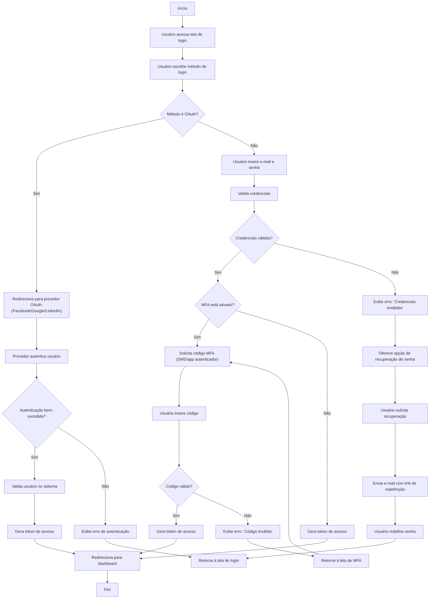

🔙 [Retornar à documentação principal](../../README.md)

# Fluxograma de Login de Usuário

Este documento descreve o processo completo de login de usuário no sistema, incluindo fluxos de autenticação OAuth, autenticação tradicional e processo de MFA (autenticação multi-fator).

## Diagrama de Fluxo

## Descrição do Processo

### Fluxo OAuth

1. Usuário escolhe entrar com provedor OAuth (Facebook/Google/LinkedIn)
2. Sistema redireciona para a página de autenticação do provedor
3. Após autenticação:
   - Se bem-sucedida: valida usuário no sistema, gera token e redireciona para dashboard
   - Se falhar: exibe erro e retorna à tela de login

### Fluxo Tradicional

1. Usuário insere e-mail e senha
2. Sistema valida credenciais:
   - Se inválidas: exibe erro e oferece recuperação de senha
   - Se válidas: verifica se MFA está ativado

### Fluxo MFA

1. Se MFA estiver ativado:
   - Sistema solicita código de verificação (SMS ou app autenticador)
   - Usuário insere código
   - Se código for válido: gera token e redireciona para dashboard
   - Se código for inválido: exibe erro e solicita novamente

### Fluxo de Recuperação de Senha

1. Usuário seleciona opção de recuperação de senha
2. Sistema envia e-mail com link de redefinição
3. Usuário redefine senha através do link
4. Usuário retorna à tela de login

## Notas de Segurança

- Tokens de acesso são JWTs com expiração de 1 hora
- Após 3 tentativas de login falhas, a conta é bloqueada por 15 minutos
- Links de redefinição de senha expiram após 30 minutos
- O MFA pode ser configurado nas preferências de usuário
